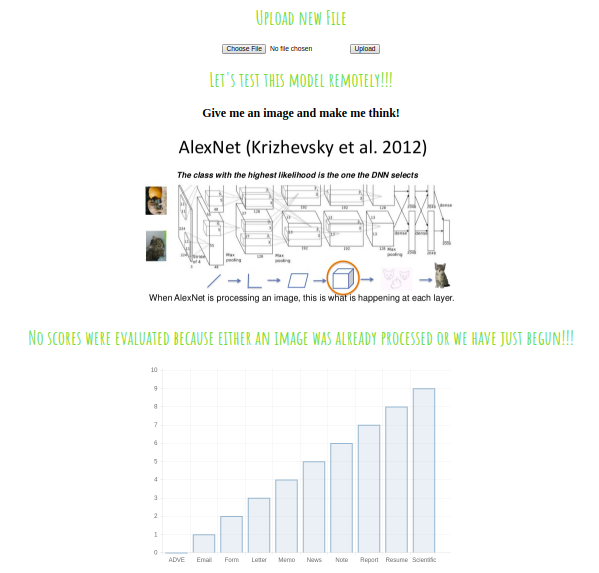
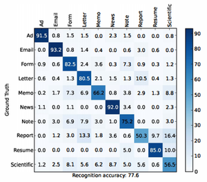
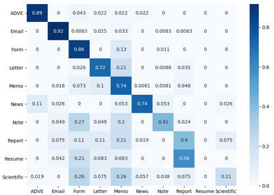

# DeepDocClassifier
## Abstract
This is a reimplementation of the **ICDAR-2015 paper** [deepdocclassifier](https://ieeexplore.ieee.org/document/7333933/). 
The model demonstrated here is [AlexNet](https://papers.nips.cc/paper/4824-imagenet-classification-with-deep-convolutional-neural-networks.pdf) (pretrained on imagenet) and finetuned for document classification on the Tobacoo-3428 dataset available [here](https://lampsrv02.umiacs.umd.edu/projdb/project.php?id=72). A sample of the training set is as following.


## Dependencies

* PyTorch
* TorchSummary
* Flask
* werkzeug
* seaborn
* TensorboardX 

## Web Interface
Run the web interface on a server by calling the web.py script from src/web/. It will open an interface on the server's ip and it can be accessed from anywhere by searching
```
server_ip:8008/interface/
``` 
in your server. This will present an interface as following. . You can upload your image and it will passed through the network loaded in web.py

## Results
The original network from the paper gives the result on the left, we get the one on the right
 